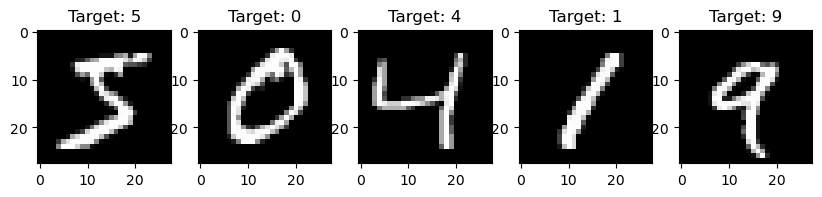
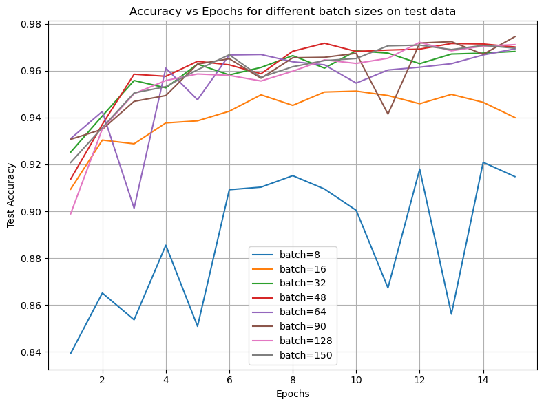
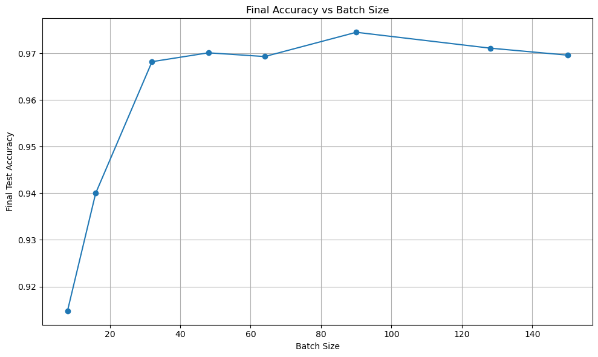
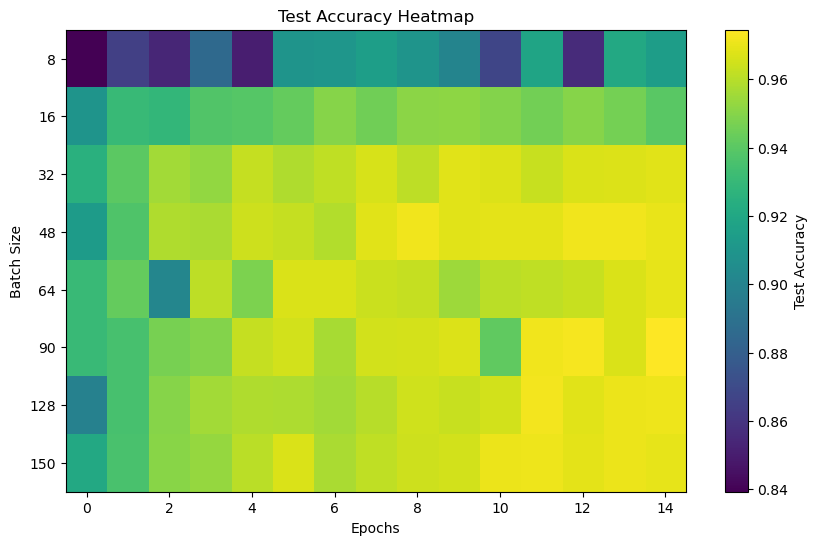
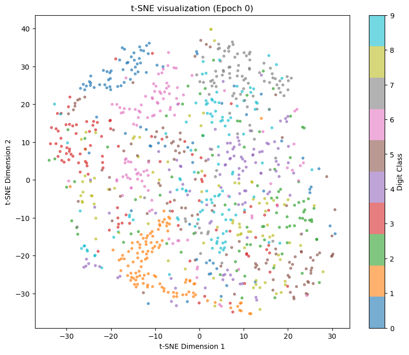
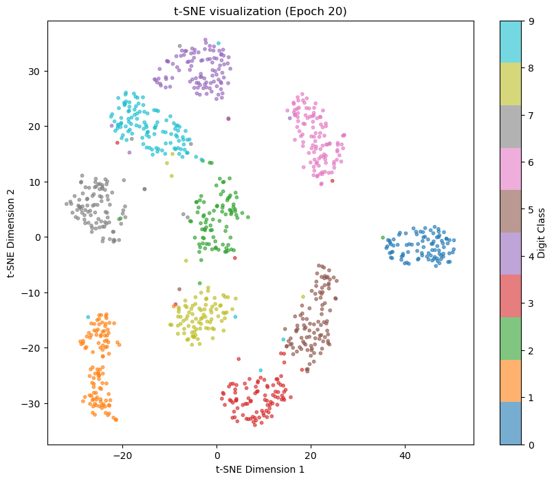

# 🧠 Handwritten Digit Classification using MLP (MNIST)

[](https://github.com/Bit-Maximum/MLP-for-MNIST/blob/main/README.md)
[](https://github.com/Bit-Maximum/MLP-for-MNIST/blob/main/translation/README.ru.md)

### 👤 Maxim Merkurev
🏫 *Far Eastern Federal University, 2025*

---

## 📌 About the project

This project explores the use of a **Multilayer Perceptron (MLP)** for classifying images from the **MNIST** dataset. The main goal is to study the effect of training parameters — such as batch size and number of epochs — on the model’s accuracy.

🔗 **Run on Colab:**  
[](https://colab.research.google.com/drive/1Z_qKQ3iwa7Gzs59P3HLrLoxs9qHRQE_a?usp=sharing)

You can also run the project locally using JupyterLab.

---

## 📊 About MNIST

MNIST is one of the most widely used datasets in machine learning. It consists of:

- `60 000` training images
- `10 000` test images
- Each image is `28×28` pixels, grayscale
- Labels range from `0` to `9` — the digits drawn in the images

Example MNIST images:



---

## 🧠 What is MLP?

**MLP (Multilayer Perceptron)** is a type of feedforward neural network composed of fully connected layers. Architecture used in this project:

1. **Input Layer**: transforms 28×28 → 784 features
2. **Hidden Layers:**
    - Layer 1: 64 neurons + ReLU
    - Layer 2: 64 neurons + ReLU
3. **Output Layer**: 10 classes (0–9) + Softmax

> Training is performed using **Stochastic Gradient Descent** and backpropagation.

---

## 📌 Training Structure

- 📥 **Data Preprocessing**: flattening + normalization
- 🔄 **Forward pass** through the layers
- 🧮 **Loss function**: `CrossEntropy`
- 🧪 **Accuracy evaluation** on test set
- 📈 **Visualization**: loss and accuracy over epochs and batch sizes

---

## 📦 Installation (for local usage)

1. Clone the repository:
```bash
git clone https://github.com/Bit-Maximum/MLP-for-MNIST.git
cd MLP-for-MNIST
```

2. Install dependencies:
```bash
pip install -r requirements.txt
```

3. Launch the notebook:
```bash
jupyter lab run.ipynb
```

---

## 📉 Results
### 📌 After training, the model achieved:
* Accuracy: `97.64%`
* Strong resistance to overfitting
* Stable performance across different batch sizes and epochs

### 📊 Visualizations included:
* Loss vs. epochs
* Accuracy evolution on training and test sets











## 📚 Theoretical Background
This project covers:
* MLP architecture basics
* ReLU and Softmax activation principles
* SGD and backpropagation mechanics
* Practical application of MLP to image classification tasks
